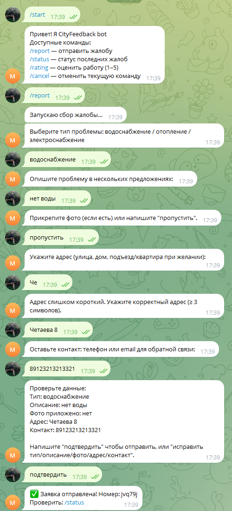
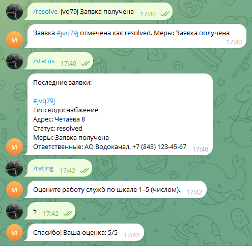
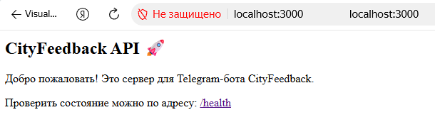
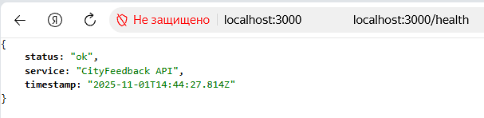

# CityFeedback Bot
Телеграм бот для сбора отзывов о работе коммунальных служб.

## Команды(возможности)
- `/report` - подать жалобу
- `/status` - просмотреть последние жалобы
- `/rating` - оценить работу служб(1-5)
- `/cancel` - отменить текущее действие

## Технологии
- Node.js, ES-модули
- Telegraf
- Express (API)
- dotenv
- Jest (тесты)
- ESLint
- FSM

## Запуск
1. Клонировать проект
2. Установить зависимости `npm install`
3. Создать `.env` файл: `BOT_TOKEN=ваш токен` и указать свой токен
4. Запустить бота `npm start`

Пример работы команд бота: 

## Запуск API
1. Запустить сервер командой `npm run api`
2. Проверить работу по адресу: `http://localhost:3000`

API:

## Проверка качетсва кода
- Запуск ESLint: `npm run lint`
Автоисправление: `npm run lint:fix`
- Запуск тестов: `npm test`
Проверка покрытия: `npm run test:coverage`

## Об авторе
Беляев Влад 

Проект для лабораторной работы по предмеиу javascript
