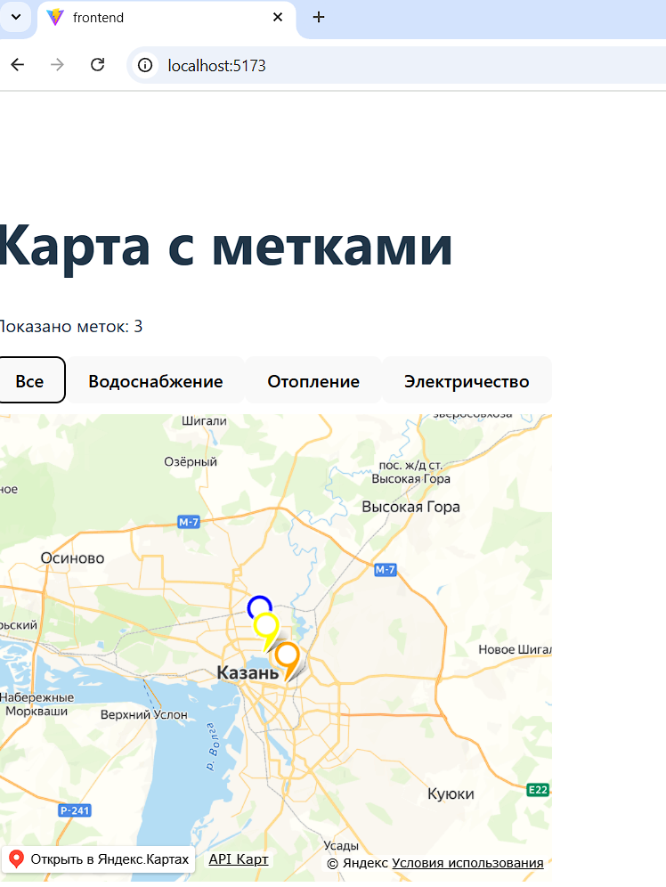
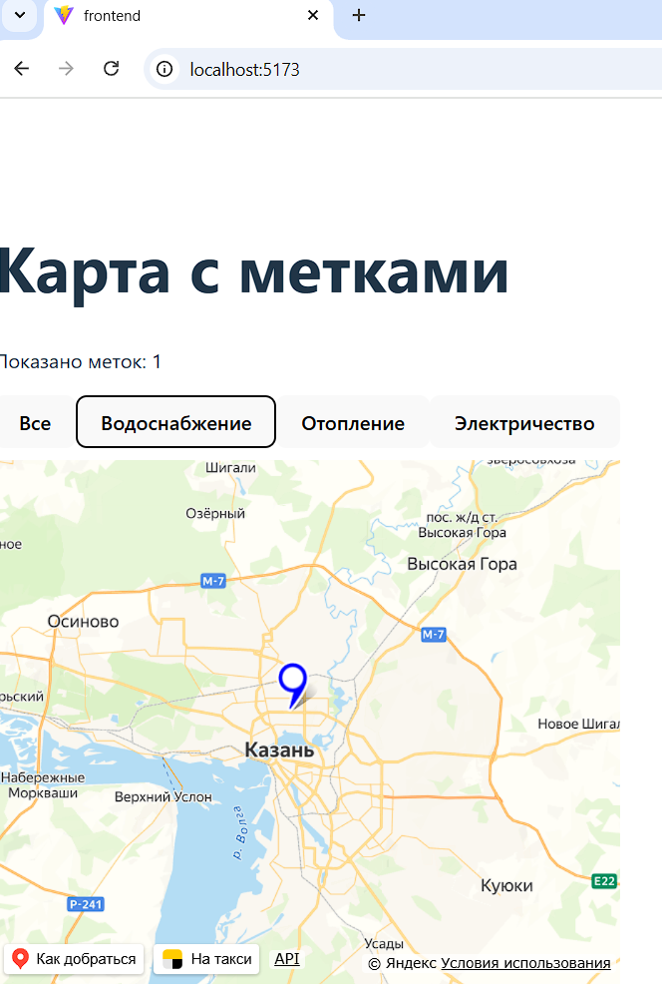
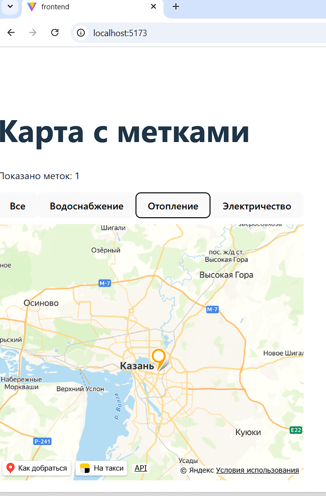
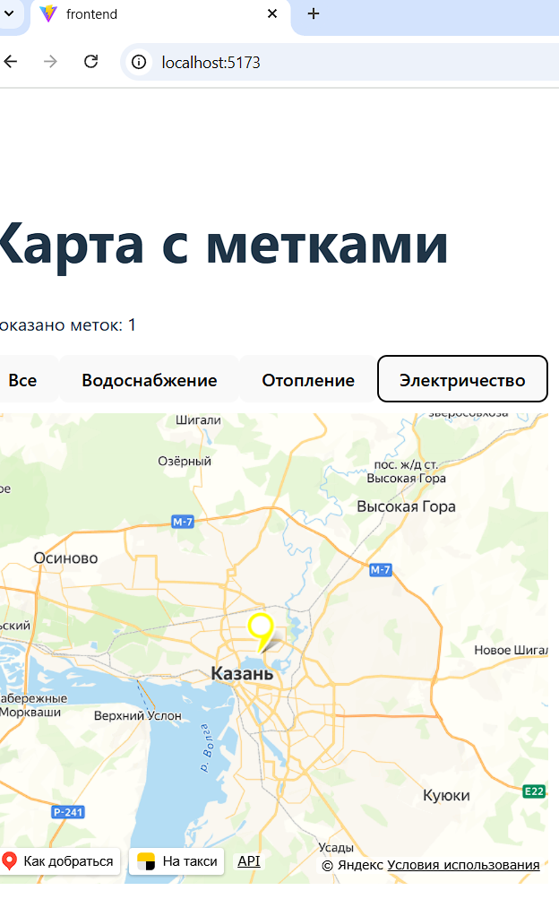

# Интерактивная карта для сбора отзывов о работе коммунальных служб

## Описание проекта
Проект состоит из двух частей:
- ui-lib: библиотека UI-компонентов на Typescript. Содержит разработанный компонент `MapComponent` для отображения интерактивной карты с метками.
- frontend: веб приложение на React, которое демонстрирует работу библиотеки

## Функциональные возможности
Компонент `MapComponent`:
- Отображает карту с возможностью масштабирования(zoom);
- Принимает список меток(markers), каждая имеет тип(type), координаты и название;
- поддерживает разные цвета меток для категорий:
	- водоснабжение - синий
	- отопление - оранжевый
	- электроснабжение - желтый
	- остальные - красный
- Позволяет фильтровать метки по типу кнопками
- При фильтрации вызывает событие `onFilter`, возвращая отфильтрованный список

## Технологии 
Node.js, Typescript, ES-модули
UI-библиотека: React, Vite, Jest, React Testing Library, ESLint
Frontend: React + Vite
Карты: @iminside/react-yandex-maps

## Установка и запуск 
1. Клонировать проект
2. Установить зависимости
```bash
cd ui-lib
npm install
cd ../frontend 
npm install
```
3. Запуск библиотеки
```bash
cd ui-lib
npm run build
```
4. Запуск 
```bash
cd ../frontend
npm run dev
```
5. Открыть http://localhost:5173/ и увидеть карту с метками и фильтрами

## Примеры работы(скриншоты)
Все метки: 


Водоснабжение: 


Отопление: 


Электричество:
